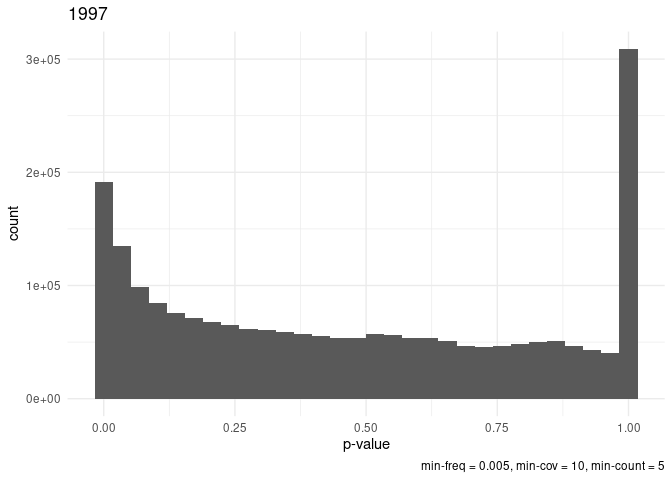
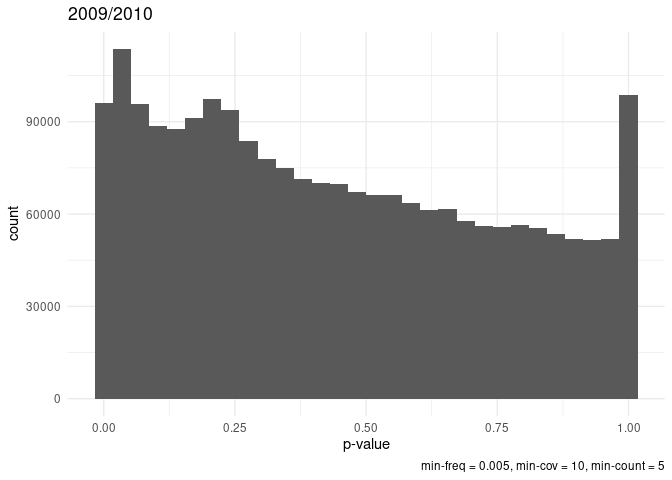
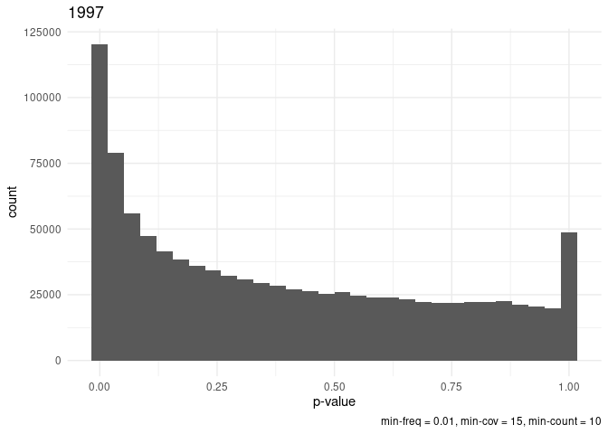
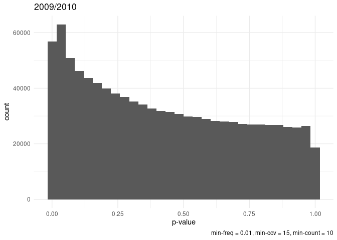

## SNP Calling

Inicialmente, os SNPs haviam sido identificados com o
[snape-pooled](https://github.com/EmanueleRaineri/snape-pooled). Esse
programa considera a qualidade e a profundidade do sequenciamento e
devolve a frequência das bases de todas as posições e a “probabilidade”
daquela posição ser realmente polimórfica. Mas havia um problema: as
amostras, os pools, precisavam correr separadamente. Isso tornava muito
difícil a comparação de um determinado SNP entre todas as populações, já
que ele poderia estar fixado em algumas delas (e, portanto, não ser
chamado nessas populações). Isso poderia ser resolvido se houvesse
alguma forma de juntar os outputs deste programa e depois filtrar todas
as posições que fossem polimórficas em pelo menos uma população. Mas os
arquivos eram muito grandes e não havia como (pelo menos eu não
consegui).

A segunda opção foi chamar os SNPs com o [PoolSNP](). Esse também é um
programa especializado em chamar os SNPs de pool-seq. Mas ele aceita
várias populações como input e identifica os SNPs olhando para todas as
populações como um todo. É um programa bastante prático, porque
possibilita que limites mínimos de profundidade e qualidade sejam
estabelecidos. Esses limites valem para todas as populações, assim,
temos a garantia que estamos comparando regiões que podem ser
comparadas. Por exemplo, ele não consideraria SNPs que nas populações de
2009/2010 estão com boa qualidade, mas que em 1997 estão com a
profundidade de leitura muito baixa. Outros parâmetros incluem o mínimo
de reads que o alelo alternativo deve ter para ser considerado
polimórfico e a frequência mínima que o SNP deve ter (esses dois
parâmetros são calculados com base em todas as populações). Além do vcf
com todos os SNPs identificados, PoolSNP também retorna um output com
todas as posições que não foram chamadas porque não passaram no controle
de qualidade.

O PoolSNP foi rodado com os seguintes parâmetros:

    bash /home/vitoria/PoolSNP/PoolSNP.sh\
        mpileup={input.mpileup}\
        reference={input.ref}\
        names=ESC97,CMD97B,WVT97,MFL97,RVA97,SVT09,CMD10,SNC10,JFL10,CMA97,HMA09,HMA17,MCT09,MCT17,MCT97\
        max-cov=0.98\
        min-cov=10\
        min-count=5\
        min-freq=0.005\
        miss-frac=0.1\
        jobs=24\
        BS=1\
        base-quality=20\
        allsites=0\

O vcf criado ficou assim:

    ## #CHROM   POS ID  REF ALT QUAL    FILTER  INFO    FORMAT  ESC97   CMD97B  WVT97   MFL97   RVA97   SVT09   CMD10   SNC10   JFL10   CMA97   HMA09   HMA17   MCT09   MCT17   MCT97
    ## 2L   5598    .   C   G   .   .   ADP=31.866666666666667;NC=0 GT:RD:AD:DP:FREQ    ./.:.:.:.:. 0/1:7:4:11:0.36 0/0:14:0:14:0.0 0/1:9:2:11:0.18 0/0:21:0:21:0.0 0/1:37:3:40:0.07    0/1:29:3:32:0.09    0/0:31:0:31:0.0 0/1:32:8:40:0.2 0/1:43:3:46:0.07    0/1:56:7:63:0.11    0/1:45:4:49:0.08    0/1:39:7:46:0.15    0/0:40:0:40:0.0 0/1:31:2:33:0.06
    ## 2L   5762    .   T   C   .   .   ADP=34.06666666666667;NC=0  GT:RD:AD:DP:FREQ    ./.:.:.:.:. 0/1:10:13:23:0.57   0/1:9:17:26:0.65    0/1:22:23:45:0.51   0/1:13:22:35:0.63   0/1:23:20:43:0.47   0/1:22:11:33:0.33   0/1:16:11:27:0.41   0/1:18:27:45:0.6    0/1:15:17:32:0.53   0/1:30:18:48:0.38   0/1:24:18:42:0.43   0/1:10:29:39:0.74   0/1:19:24:43:0.56   0/1:19:4:23:0.17
    ## 2L   5776    .   C   G   .   .   ADP=34.0;NC=0   GT:RD:AD:DP:FREQ    ./.:.:.:.:. 0/1:24:3:27:0.11    0/0:25:0:25:0.0 0/0:41:0:41:0.0 0/1:32:1:33:0.03    0/1:40:4:44:0.09    0/1:31:1:32:0.03    0/0:26:0:26:0.0 0/1:45:1:46:0.02    0/0:37:0:37:0.0 0/1:46:3:49:0.06    0/0:43:0:43:0.0 0/0:39:0:39:0.0 0/1:39:1:40:0.03    0/0:22:0:22:0.0
    ## 2L   5803    .   A   G   .   .   ADP=32.0;NC=0   GT:RD:AD:DP:FREQ    ./.:.:.:.:. 0/0:19:0:19:0.0 0/1:18:2:20:0.1 0/0:31:0:31:0.0 0/0:34:0:34:0.0 0/1:47:3:50:0.06    0/1:28:1:29:0.03    0/0:23:0:23:0.0 0/1:45:1:46:0.02    0/0:36:0:36:0.0 0/1:53:1:54:0.02    0/1:37:1:38:0.03    0/1:37:1:38:0.03    0/0:39:0:39:0.0 0/0:18:0:18:0.0
    ## 2L   5813    .   G   T   .   .   ADP=31.666666666666668;NC=0 GT:RD:AD:DP:FREQ    ./.:.:.:.:. 0/0:14:0:14:0.0 0/0:17:0:17:0.0 0/0:29:0:29:0.0 0/1:33:2:35:0.06    0/1:47:2:49:0.04    0/0:29:0:29:0.0 0/0:23:0:23:0.0 0/0:46:0:46:0.0 0/1:38:1:39:0.03    0/0:50:0:50:0.0 0/0:42:0:42:0.0 0/0:41:0:41:0.0 0/1:35:1:36:0.03    0/1:19:1:20:0.05
    ## 2L   5889    .   T   C   .   .   ADP=39.6;NC=0   GT:RD:AD:DP:FREQ    ./.:.:.:.:. 0/1:9:6:15:0.4  0/1:14:10:24:0.42   0/1:18:6:24:0.25    0/1:37:6:43:0.14    0/1:49:11:60:0.18   0/1:22:16:38:0.42   0/1:21:9:30:0.3 0/1:41:15:56:0.27   0/1:36:15:51:0.29   0/1:54:16:70:0.23   0/1:43:9:52:0.17    0/1:38:13:51:0.25   0/1:36:9:45:0.2 0/1:22:9:31:0.29
    ## 2L   5904    .   C   A   .   .   ADP=38.2;NC=0   GT:RD:AD:DP:FREQ    ./.:.:.:.:. 0/1:3:15:18:0.83    0/1:5:19:24:0.79    0/1:7:19:26:0.73    0/1:13:26:39:0.67   0/1:28:29:57:0.51   0/1:15:17:32:0.53   0/1:12:16:28:0.57   0/1:18:36:54:0.67   0/1:17:31:48:0.65   0/1:32:37:69:0.54   0/1:22:27:49:0.55   0/1:10:41:51:0.8    0/1:18:25:43:0.58   0/1:16:15:31:0.48
    ## 2L   5907    .   G   C   .   .   ADP=37.8;NC=0   GT:RD:AD:DP:FREQ    ./.:.:.:.:. 0/1:13:6:19:0.32    0/1:16:7:23:0.3 0/1:21:5:26:0.19    0/1:32:6:38:0.16    0/1:46:9:55:0.16    0/1:20:14:34:0.41   0/1:23:5:28:0.18    0/1:41:13:54:0.24   0/1:34:12:46:0.26   0/1:53:14:67:0.21   0/1:40:8:48:0.17    0/1:39:11:50:0.22   0/1:35:9:44:0.2 0/1:24:7:31:0.23
    ## 2L   5914    .   C   T   .   .   ADP=37.666666666666664;NC=0 GT:RD:AD:DP:FREQ    ./.:.:.:.:. 0/1:14:6:20:0.3 0/1:19:7:26:0.27    0/1:18:5:23:0.22    0/1:33:6:39:0.15    0/1:45:10:55:0.18   0/1:17:14:31:0.45   0/1:23:5:28:0.18    0/1:40:13:53:0.25   0/1:35:12:47:0.26   0/1:53:13:66:0.2    0/1:41:8:49:0.16    0/1:37:11:48:0.23   0/1:33:9:42:0.21    0/1:27:8:35:0.23

## Frequências e Número Efetivo de Cromossomos

Extraí as frequências e a profundidade de leitura de cada SNP, com o
script
[freq\_extraction.R](https://github.com/VitoriaHorvathMiranda/ident_clinalSNPs/blob/main/freq_extraction.R).

<table>
<thead>
<tr class="header">
<th style="text-align: left;">CHROM</th>
<th style="text-align: right;">POS</th>
<th style="text-align: left;">REF</th>
<th style="text-align: left;">ALT</th>
<th style="text-align: left;">population</th>
<th style="text-align: left;">depth</th>
<th style="text-align: left;">freq</th>
</tr>
</thead>
<tbody>
<tr class="odd">
<td style="text-align: left;">2L</td>
<td style="text-align: right;">5598</td>
<td style="text-align: left;">C</td>
<td style="text-align: left;">G</td>
<td style="text-align: left;">ESC97</td>
<td style="text-align: left;">.</td>
<td style="text-align: left;">.</td>
</tr>
<tr class="even">
<td style="text-align: left;">2L</td>
<td style="text-align: right;">5598</td>
<td style="text-align: left;">C</td>
<td style="text-align: left;">G</td>
<td style="text-align: left;">CMD97B</td>
<td style="text-align: left;">11</td>
<td style="text-align: left;">0.36</td>
</tr>
<tr class="odd">
<td style="text-align: left;">2L</td>
<td style="text-align: right;">5598</td>
<td style="text-align: left;">C</td>
<td style="text-align: left;">G</td>
<td style="text-align: left;">WVT97</td>
<td style="text-align: left;">14</td>
<td style="text-align: left;">0.0</td>
</tr>
<tr class="even">
<td style="text-align: left;">2L</td>
<td style="text-align: right;">5598</td>
<td style="text-align: left;">C</td>
<td style="text-align: left;">G</td>
<td style="text-align: left;">MFL97</td>
<td style="text-align: left;">11</td>
<td style="text-align: left;">0.18</td>
</tr>
<tr class="odd">
<td style="text-align: left;">2L</td>
<td style="text-align: right;">5598</td>
<td style="text-align: left;">C</td>
<td style="text-align: left;">G</td>
<td style="text-align: left;">RVA97</td>
<td style="text-align: left;">21</td>
<td style="text-align: left;">0.0</td>
</tr>
<tr class="even">
<td style="text-align: left;">2L</td>
<td style="text-align: right;">5598</td>
<td style="text-align: left;">C</td>
<td style="text-align: left;">G</td>
<td style="text-align: left;">SVT09</td>
<td style="text-align: left;">40</td>
<td style="text-align: left;">0.07</td>
</tr>
<tr class="odd">
<td style="text-align: left;">2L</td>
<td style="text-align: right;">5598</td>
<td style="text-align: left;">C</td>
<td style="text-align: left;">G</td>
<td style="text-align: left;">CMD10</td>
<td style="text-align: left;">32</td>
<td style="text-align: left;">0.09</td>
</tr>
<tr class="even">
<td style="text-align: left;">2L</td>
<td style="text-align: right;">5598</td>
<td style="text-align: left;">C</td>
<td style="text-align: left;">G</td>
<td style="text-align: left;">SNC10</td>
<td style="text-align: left;">31</td>
<td style="text-align: left;">0.0</td>
</tr>
<tr class="odd">
<td style="text-align: left;">2L</td>
<td style="text-align: right;">5598</td>
<td style="text-align: left;">C</td>
<td style="text-align: left;">G</td>
<td style="text-align: left;">JFL10</td>
<td style="text-align: left;">40</td>
<td style="text-align: left;">0.2</td>
</tr>
<tr class="even">
<td style="text-align: left;">2L</td>
<td style="text-align: right;">5598</td>
<td style="text-align: left;">C</td>
<td style="text-align: left;">G</td>
<td style="text-align: left;">CMA97</td>
<td style="text-align: left;">46</td>
<td style="text-align: left;">0.07</td>
</tr>
</tbody>
</table>

Em seguida calculei o número efetivo de cromossomos com o script
[n\_chrom.R](https://github.com/VitoriaHorvathMiranda/ident_clinalSNPs/blob/main/n_chrom.R).
Para fazer isso usei o número de cromossomos amostrado em cada população
e a profundidade de leitura. O número de cromossomos amostrados em cada
população estava na tabela de metadados e a profundidade de leitura foi
extraída do vcf.

    freqs[, NE := ((1/depth) + (1/n_chrom))^-1]

<table>
<colgroup>
<col style="width: 16%" />
<col style="width: 13%" />
<col style="width: 11%" />
<col style="width: 8%" />
<col style="width: 7%" />
<col style="width: 5%" />
<col style="width: 5%" />
<col style="width: 8%" />
<col style="width: 7%" />
<col style="width: 13%" />
</colgroup>
<thead>
<tr class="header">
<th style="text-align: left;">population</th>
<th style="text-align: right;">latitude</th>
<th style="text-align: right;">n_chrom</th>
<th style="text-align: left;">CHROM</th>
<th style="text-align: right;">POS</th>
<th style="text-align: left;">REF</th>
<th style="text-align: left;">ALT</th>
<th style="text-align: right;">depth</th>
<th style="text-align: right;">freq</th>
<th style="text-align: right;">NE</th>
</tr>
</thead>
<tbody>
<tr class="odd">
<td style="text-align: left;">CMA97</td>
<td style="text-align: right;">42.46</td>
<td style="text-align: right;">280</td>
<td style="text-align: left;">2L</td>
<td style="text-align: right;">5598</td>
<td style="text-align: left;">C</td>
<td style="text-align: left;">G</td>
<td style="text-align: right;">46</td>
<td style="text-align: right;">0.07</td>
<td style="text-align: right;">39.50920</td>
</tr>
<tr class="even">
<td style="text-align: left;">CMA97</td>
<td style="text-align: right;">42.46</td>
<td style="text-align: right;">280</td>
<td style="text-align: left;">2L</td>
<td style="text-align: right;">5762</td>
<td style="text-align: left;">T</td>
<td style="text-align: left;">C</td>
<td style="text-align: right;">32</td>
<td style="text-align: right;">0.53</td>
<td style="text-align: right;">28.71795</td>
</tr>
<tr class="odd">
<td style="text-align: left;">CMA97</td>
<td style="text-align: right;">42.46</td>
<td style="text-align: right;">280</td>
<td style="text-align: left;">2L</td>
<td style="text-align: right;">5776</td>
<td style="text-align: left;">C</td>
<td style="text-align: left;">G</td>
<td style="text-align: right;">37</td>
<td style="text-align: right;">0.00</td>
<td style="text-align: right;">32.68139</td>
</tr>
<tr class="even">
<td style="text-align: left;">CMA97</td>
<td style="text-align: right;">42.46</td>
<td style="text-align: right;">280</td>
<td style="text-align: left;">2L</td>
<td style="text-align: right;">5803</td>
<td style="text-align: left;">A</td>
<td style="text-align: left;">G</td>
<td style="text-align: right;">36</td>
<td style="text-align: right;">0.00</td>
<td style="text-align: right;">31.89873</td>
</tr>
<tr class="odd">
<td style="text-align: left;">CMA97</td>
<td style="text-align: right;">42.46</td>
<td style="text-align: right;">280</td>
<td style="text-align: left;">2L</td>
<td style="text-align: right;">5813</td>
<td style="text-align: left;">G</td>
<td style="text-align: left;">T</td>
<td style="text-align: right;">39</td>
<td style="text-align: right;">0.03</td>
<td style="text-align: right;">34.23197</td>
</tr>
<tr class="even">
<td style="text-align: left;">CMA97</td>
<td style="text-align: right;">42.46</td>
<td style="text-align: right;">280</td>
<td style="text-align: left;">2L</td>
<td style="text-align: right;">5889</td>
<td style="text-align: left;">T</td>
<td style="text-align: left;">C</td>
<td style="text-align: right;">51</td>
<td style="text-align: right;">0.29</td>
<td style="text-align: right;">43.14199</td>
</tr>
<tr class="odd">
<td style="text-align: left;">CMA97</td>
<td style="text-align: right;">42.46</td>
<td style="text-align: right;">280</td>
<td style="text-align: left;">2L</td>
<td style="text-align: right;">5904</td>
<td style="text-align: left;">C</td>
<td style="text-align: left;">A</td>
<td style="text-align: right;">48</td>
<td style="text-align: right;">0.65</td>
<td style="text-align: right;">40.97561</td>
</tr>
<tr class="even">
<td style="text-align: left;">CMA97</td>
<td style="text-align: right;">42.46</td>
<td style="text-align: right;">280</td>
<td style="text-align: left;">2L</td>
<td style="text-align: right;">5907</td>
<td style="text-align: left;">G</td>
<td style="text-align: left;">C</td>
<td style="text-align: right;">46</td>
<td style="text-align: right;">0.26</td>
<td style="text-align: right;">39.50920</td>
</tr>
<tr class="odd">
<td style="text-align: left;">CMA97</td>
<td style="text-align: right;">42.46</td>
<td style="text-align: right;">280</td>
<td style="text-align: left;">2L</td>
<td style="text-align: right;">5914</td>
<td style="text-align: left;">C</td>
<td style="text-align: left;">T</td>
<td style="text-align: right;">47</td>
<td style="text-align: right;">0.26</td>
<td style="text-align: right;">40.24465</td>
</tr>
<tr class="even">
<td style="text-align: left;">CMA97</td>
<td style="text-align: right;">42.46</td>
<td style="text-align: right;">280</td>
<td style="text-align: left;">2L</td>
<td style="text-align: right;">5919</td>
<td style="text-align: left;">T</td>
<td style="text-align: left;">A</td>
<td style="text-align: right;">44</td>
<td style="text-align: right;">0.25</td>
<td style="text-align: right;">38.02469</td>
</tr>
</tbody>
</table>

Separei esse arquivo em outros três com base no ano em que a população
foi coletada. Então no final formei três tabelas, uma com as populações
de 1997, uma com as populações de 2009/2010 e uma última com as
populações de 2017.

## Glm

Para identificar os SNPs clinais era preciso correr um GLM para cada SNP
de cada período. Usei o mesmo GLM escolhido pelo Murillo, mas talvez
isso possa ser debatido. É um modelo com a frequência dos SNPs como
variável preditora e a latitude como variável resposta, com função de
ligação binomial e pesado para o número efetivo de cromossomos
[glm\_script.R](https://github.com/VitoriaHorvathMiranda/ident_clinalSNPs/blob/main/glm_script.R)

    nested_snps[, models := purrr::map(data, ~ glm(freq~latitude, 
                                                   weights = NE,
                                                   data = .x,
                                                   family = binomial()))]

    ##     position2              data    models
    ##  1:   2L:5598 <data.table[6x8]> <glm[30]>
    ##  2:   2L:5762 <data.table[6x8]> <glm[30]>
    ##  3:   2L:5776 <data.table[6x8]> <glm[30]>
    ##  4:   2L:5803 <data.table[6x8]> <glm[30]>
    ##  5:   2L:5813 <data.table[6x8]> <glm[30]>
    ##  6:   2L:5889 <data.table[6x8]> <glm[30]>
    ##  7:   2L:5904 <data.table[6x8]> <glm[30]>
    ##  8:   2L:5907 <data.table[6x8]> <glm[30]>
    ##  9:   2L:5914 <data.table[6x8]> <glm[30]>
    ## 10:   2L:5919 <data.table[6x8]> <glm[30]>

olhando para um modelo:

    pluck(nested_snps[[3]]) %>% pluck(1)

    ## 
    ## Call:  glm(formula = freq ~ latitude, family = binomial(), data = .x, 
    ##     weights = NE)
    ## 
    ## Coefficients:
    ## (Intercept)     latitude  
    ##     0.73132     -0.07958  
    ## 
    ## Degrees of Freedom: 5 Total (i.e. Null);  4 Residual
    ## Null Deviance:       13.02 
    ## Residual Deviance: 11.69     AIC: 27.88

    nested_snps[, summary := purrr::map(models, 
                                            ~summary(.x))]
    pluck(nested_snps[[4]]) %>% pluck(1)

    ## 
    ## Call:
    ## glm(formula = freq ~ latitude, family = binomial(), data = .x, 
    ##     weights = NE)
    ## 
    ## Deviance Residuals: 
    ##        1         2         3         4         5         6  
    ##  0.09707   2.46751  -0.23661   0.01153  -1.97357  -1.27979  
    ## 
    ## Coefficients:
    ##             Estimate Std. Error z value Pr(>|z|)
    ## (Intercept)  0.73132    2.54648   0.287    0.774
    ## latitude    -0.07958    0.06500  -1.224    0.221
    ## 
    ## (Dispersion parameter for binomial family taken to be 1)
    ## 
    ##     Null deviance: 13.016  on 5  degrees of freedom
    ## Residual deviance: 11.687  on 4  degrees of freedom
    ## AIC: 27.876
    ## 
    ## Number of Fisher Scoring iterations: 5

Então extrai o coeficiente de inclinação e o p-valor associado ao
coeficiente de inclinação de cada glm:

    #gets lat coefficient
    nested_snps[, coefficients := purrr::map_dbl(models, ~coef(.x) %>% pluck("latitude"))]

    #gets p-value
    nested_snps[, p_value := purrr::map_dbl(models, 
                                             ~summary(.x) %>% 
                                               pluck("coefficients") %>% pluck(8))]
    nested_snps

    ##     position2              data    models           summary coefficients
    ##  1:   2L:5598 <data.table[6x8]> <glm[30]> <summary.glm[17]> -0.079582405
    ##  2:   2L:5762 <data.table[6x8]> <glm[30]> <summary.glm[17]> -0.002554832
    ##  3:   2L:5776 <data.table[6x8]> <glm[30]> <summary.glm[17]>  0.027677329
    ##  4:   2L:5803 <data.table[6x8]> <glm[30]> <summary.glm[17]> 16.190050706
    ##  5:   2L:5813 <data.table[6x8]> <glm[30]> <summary.glm[17]>  0.057407420
    ##  6:   2L:5889 <data.table[6x8]> <glm[30]> <summary.glm[17]>  0.047763132
    ##  7:   2L:5904 <data.table[6x8]> <glm[30]> <summary.glm[17]> -0.020118518
    ##  8:   2L:5907 <data.table[6x8]> <glm[30]> <summary.glm[17]>  0.039469471
    ##  9:   2L:5914 <data.table[6x8]> <glm[30]> <summary.glm[17]>  0.025109305
    ## 10:   2L:5919 <data.table[6x8]> <glm[30]> <summary.glm[17]>  0.044700369
    ##       p_value
    ##  1: 0.2208013
    ##  2: 0.9269228
    ##  3: 0.7990172
    ##  4: 0.9993280
    ##  5: 0.6256013
    ##  6: 0.2336224
    ##  7: 0.5665359
    ##  8: 0.3385905
    ##  9: 0.5432611
    ## 10: 0.3033979

## P-valores

Decidi fazer um histograma dos p-valores para entender como eles estavam
distribuídos, e notei que tanto a distribuição dos SNPs de 1997 quanto
as de 2009/2010, havia uma excesso de SNPs com p-valores muito altos.

A minha teoria para explicar esse comportamento é de que existia um
excesso de SNPs raros, com baixa frequência e presentes em uma ou poucas
populações, e que, quando eram testados pelo modelo, não eram nada
clinais (por isso os p-valores altos). Acho que é até possível
argumentar que alguns desses SNPs nem sejam SNPs verdadeiros, mas sim
erros de sequenciamento. Isso porque, como são muitos SNPs, mesmo com um
filtro de qualidade de base 20 (probabilidade de erro de 1 a cada 1000),
não é possível de se livrar de todos os erros. Como inicialmente eu
tinha chamado os SNPs com um filtro de frequência de 0.5%, resolvi
chamar novamente os SNPs, mas dessa vez com um filtro de 1% de
frequência. Também aumentei outros filtros, a cobertura mínima exigida
passou a ser de 15 (antes era de 10) e a base alternativa deveria ser
lida pelo menos 10 vezes para ser considerada. O Comando para isso ficou
assim:

    bash /home/vitoria/PoolSNP/PoolSNP.sh\
        mpileup={input.mpileup}\
        reference={input.ref}\
        names=ESC97,CMD97B,WVT97,MFL97,RVA97,SVT09,CMD10,SNC10,JFL10,CMA97,HMA09,HMA17,MCT09,MCT17,MCT97\
        max-cov=0.98\
        min-cov=15\
        min-count=10\
        min-freq=0.01\
        miss-frac=0.1\
        jobs=24\
        BS=1\
        base-quality=20\
        allsites=0\
        output={params.outdir}

Corri todo o pipeline novamente e o número de SNPs com p-valores altos
diminuiu consideravelmente:

## P-value cutoff

Existe ainda outro script
([FDR\_script.R](https://github.com/VitoriaHorvathMiranda/ident_clinalSNPs/blob/main/FDR_script.R))
que escrevi para calcular o p-valor para um dado FDR. Isso foi feito com
o pacote [qvalue](https://github.com/StoreyLab/qvalue), criado pelos
autores do paper [Storey and Tibshirani,
2003](https://www.pnas.org/doi/abs/10.1073/pnas.1530509100).
